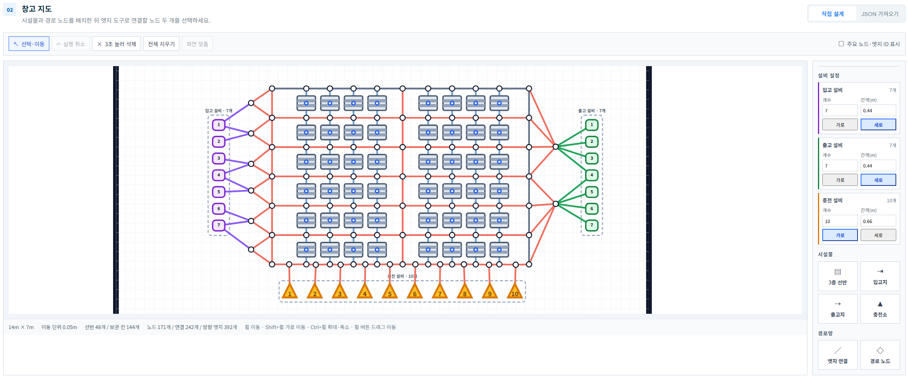
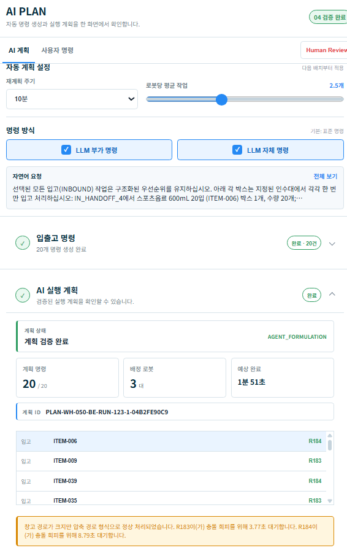
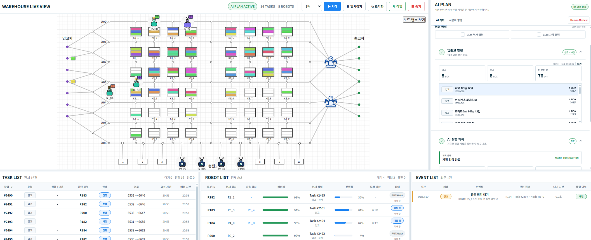
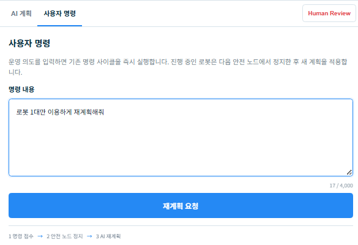
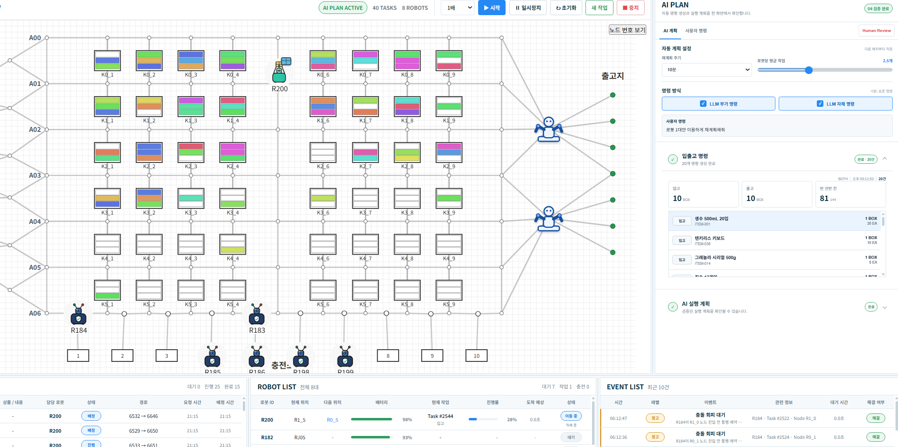

# LARO

> **Digital Twin 기반 자율 창고 운영 및 다중 로봇 작업 최적화 시스템**
> 
> **프로젝트 기간**: 2026.07 ~ 2026.08
> 
> **역할**: Backend Developer
> 
> **프로젝트 형태**: KT AIVLE School 9기 Big Project

LARO(LLM Autonomous Robot Orchestration)는  
창고·재고·로봇의 현재 상태를 기반으로 AI가 작업 계획을 생성하고,
다중 로봇의 작업 배정·경로 최적화·실시간 실행·재계획까지 연결하는 창고 운영 시스템입니다.

단순한 로봇 경로 탐색이 아니라,

**Digital Twin → AI Planning → 작업 최적화 → 다중 로봇 이동 계획 → 실시간 관제 → Dynamic Replanning**

의 전체 운영 흐름을 구현했습니다.

> 본 저장소는 팀 프로젝트에서 제가 담당한 **Backend 설계·구현 및 문제 해결 과정**을 중심으로 정리한 개인 포트폴리오입니다.

---

## 프로젝트 개요

물류센터에 다수의 AGV·AMR이 도입되면서
개별 로봇의 이동보다 **여러 로봇의 작업과 이동을 동시에 조율하는 문제**가 중요해지고 있습니다.

실제 운영 중에는 신규 작업, 배터리 변화, 통로 차단 등으로
초기에 생성한 계획의 유효성이 계속 달라질 수 있습니다.

LARO는 현재 창고 상태를 기준으로 AI가 실행 계획을 구성하고,
Optimization Solver와 MAPF를 통해 작업 배정과 이동 계획을 계산한 뒤
Simulation에서 이를 실행·관제하고 상태 변화 발생 시 재계획합니다.

```text
Warehouse State
      ↓
AI Planning
      ↓
Task Assignment / Optimization
      ↓
MAPF
      ↓
Simulation
      ↓
Real-time Monitoring
      ↓
Dynamic Replanning
```

---

## 주요 기능

### Digital Twin 창고 구성

- 창고 시설과 로봇 이동 지점을 배치하고 `Node · Edge` 기반 이동 경로 구성
- 입고·출고·충전 설비와 선반을 직접 편집하거나 JSON을 통해 창고 레이아웃 생성
- 구성한 창고 구조를 AI Planning과 Simulation의 동일한 Digital Twin 실행 환경으로 활용

<p align="center">
  
</p>

---

### AI 기반 작업 계획

- 자연어 요청과 실제 창고 상태를 기반으로 실행 가능한 Mission 구성
- 요청의 형태와 복잡도에 따라 `Rule / Agent` 처리 경로 분리
- LLM은 요청과 운영 조건을 해석하고, 실제 작업 배정과 경로 계산은 Optimization Solver에 위임

<p align="center">
  
</p>

---

### 다중 로봇 작업·경로 최적화

- 여러 작업을 로봇별로 배정하고 작업 수행 순서를 최적화
- MAPF를 통해 여러 로봇의 이동 경로와 충돌 가능성을 함께 고려
- 최종 계획을 `MOVE · WAIT · SERVICE` 단위의 실행 가능한 Robot Plan으로 구성

```text
LLM / Agent
Mission · Constraints
        ↓
Optimization Solver
작업 배정 · 방문 순서
        ↓
MAPF
다중 로봇 이동 계획
        ↓
MOVE · WAIT · SERVICE
```

> **LLM은 판단하고, Solver는 계산하도록 역할을 분리했습니다.**

---

### 실시간 Simulation & Monitoring

- AI가 생성한 계획을 Backend에서 검증한 뒤 실제 Simulation 실행 데이터로 적용
- 로봇의 위치·배터리·작업 진행 상태와 이동 과정을 실시간으로 확인
- Task · Robot · Event 정보를 한 화면에서 통합 관제

<p align="center">
  
</p>

---

### Dynamic Replanning

- 실행 중 운영자의 추가 명령이나 상태 변화를 현재 실행 상태에 반영
- 기존 실행 상태와 남은 작업을 기준으로 새로운 계획 생성
- 재계획 결과를 다시 Simulation에 적용하여 변경된 운영 조건으로 실행

**① 운영자 자연어 재계획 요청**

<p align="center">
  
</p>

**② 재계획 결과 Simulation 반영**

<p align="center">
  
</p>

---

### 사용자별 독립 Simulation

- Shared Warehouse를 기반으로 USER / GUEST별 Personal Warehouse 생성
- 재고·로봇·시나리오 등 실행 데이터를 사용자별로 독립 관리
- Warehouse 소유권을 검증하여 사용자 간 Simulation 상태 충돌 방지

---

## 시스템 아키텍처

```text
┌─────────────────────────────┐
│        React Frontend       │
└──────────────┬──────────────┘
               │ REST / STOMP
               ▼
┌─────────────────────────────┐
│         Spring Boot         │
│                             │
│ Auth · Warehouse · Robot    │
│ Task · Simulation · AI 연동 │
└───────┬───────────┬─────────┘
        │           │
        │           └──────→ Redis
        │                   Runtime State
        ▼
     FastAPI
        │
        ▼
 GPT-5-mini / LangGraph
        │
        ▼
 Optimization Solver
 cuOpt / OR-Tools
        │
        ▼
       MAPF


PostgreSQL
    │
    │ AFTER_COMMIT
    ▼
  Neo4j
Warehouse Graph
```

### Data Store 역할

| 저장소 | 역할 |
|---|---|
| **PostgreSQL** | Warehouse, Robot, Inventory, Task, Scenario 등 영속 데이터 |
| **Redis** | 로봇 위치·배터리·실행 상태 등 Runtime State |
| **Neo4j** | Node·Edge와 창고 객체 간 이동·접근 관계 |

---

## 담당 역할 및 기여

팀 내 Backend 개발을 담당하며  
**창고·로봇·그래프 및 사용자별 실행 환경 영역**을 구현했습니다.

- Warehouse / Zone / Node / Edge API 설계 및 구현
- Robot 및 Warehouse Layout 데이터 연동
- USER / GUEST별 독립적인 Simulation 실행 환경 설계
- Shared Warehouse → Personal Warehouse Deep Clone 구현
- Warehouse Resource 소유권 검증 및 접근 제어
- PostgreSQL → Neo4j Warehouse Graph Sync 구현
- AI Planning에서 활용할 Warehouse Graph API 구현
- Backend / AI / Frontend 통합 작업 참여

특히

**다중 사용자 실행 상태 격리**,  
**PostgreSQL·Neo4j 데이터 일관성**,  
**Warehouse 데이터를 AI Planning에서 사용할 수 있도록 연결하는 과정**

을 주요 Backend 설계 과제로 다뤘습니다.

---

## 핵심 설계 및 구현

### 1. 사용자별 Digital Twin 실행 환경 격리

여러 사용자가 동일한 Shared Warehouse에서 Simulation을 실행하면
재고와 Robot 상태가 서로 영향을 받을 수 있기 때문에,
Shared Warehouse를 Template으로 사용하고 사용자별 실행 환경을 분리했습니다.

```text
Shared Template
      │
      ├──→ User A → Personal Warehouse A
      ├──→ User B → Personal Warehouse B
      └──→ Guest  → Personal Warehouse C
```

Personal Warehouse 생성 시 실행에 영향을 주는 데이터를 함께 Deep Clone합니다.

```text
Warehouse
Zone
Node
Edge
ChargingStation
StorageLocation
WarehouseItem
Robot
Scenario
```

USER는 `user_id`,
GUEST는 `guest_session_id`를 기준으로 소유권을 관리합니다.

Simulation 실행 시에도 Warehouse Ownership을 다시 검증하여
다른 사용자의 `warehouseId`를 직접 전달하는 방식의 접근을 차단했습니다.

이를 통해 각 사용자의 Inventory·Robot·Simulation 상태를
독립적으로 유지할 수 있도록 구성했습니다.

---

### 2. PostgreSQL과 Neo4j 데이터 일관성

Warehouse의 기준 데이터는 PostgreSQL에서 관리하고,
Neo4j는 Node·Edge와 공간 객체의 이동·접근 관계를 표현하는
Graph Projection으로 구성했습니다.

두 저장소를 직접 동시에 수정하는 방식 대신
PostgreSQL Transaction이 정상적으로 Commit된 이후에만
Neo4j Graph Sync가 수행되도록 설계했습니다.

```text
Warehouse 데이터 변경
        ↓
PostgreSQL Transaction
        ↓
COMMIT
        ↓
WarehouseGraphChangedEvent
        ↓
AFTER_COMMIT Listener
        ↓
GraphSyncService
        ↓
Neo4j Warehouse Graph Sync
```

```java
@TransactionalEventListener(
    phase = TransactionPhase.AFTER_COMMIT
)
```

`WarehouseGraphChangedEvent`는 변경 데이터 전체를 전달하지 않고
동기화가 필요한 `warehouseId`를 전달하는 Trigger 역할을 합니다.

Graph Sync 시 PostgreSQL의 현재 Warehouse 데이터를 다시 조회하여
해당 Warehouse Scope의 Graph를 갱신합니다.

이를 통해 **PostgreSQL을 Source of Truth로 유지하면서
Neo4j Graph를 재생성 가능한 Projection으로 관리**했습니다.

---

### 3. Warehouse Graph API 및 AI Planning 데이터 제공

AI Planning에서 현재 Warehouse의 이동 구조를 사용할 수 있도록
Node · Edge 기반 Graph 조회 구조를 구성했습니다.

```text
PostgreSQL Warehouse
        ↓
WarehouseGraphService
        ↓
WarehouseGraphResponse
        ├─ nodeCode
        ├─ edgeCode
        ├─ mapVersion
        └─ Node / Edge 속성
                ↓
           AI Planning
```

DB 내부에서는 Numeric PK를 사용하지만,
Frontend와 AI Planning에서는 `nodeCode`와 `edgeCode`를 기준으로
Warehouse Map을 식별하도록 분리했습니다.

또한 현재 Active Node와 Edge를 기반으로 `mapVersion`을 구성하여
AI가 사용하는 Warehouse Map의 상태를 구분할 수 있도록 했습니다.

이를 통해 AI가 별도의 임의 지도 구조를 사용하는 것이 아니라,
Backend가 관리하는 현재 Warehouse 구조를 AI Planning에서 활용할 수 있도록 Graph API로 제공했습니다.

---

## Troubleshooting

### 1. Backend와 AI의 Replanning 책임 중복

**증상**

초기에는 Backend에서 재계획 로직을 처리하는 구조를 구현했지만,
AI Planning 기능이 확장되면서 Backend와 AI가
동일한 재계획 책임을 가지는 문제가 발생했습니다.

**원인**

기존 Backend 중심 재계획 구조에
AI Agent 기반 Replanning 기능이 추가되면서
기존 책임을 유지한 채 기능이 확장되었습니다.

**개선**

각 서비스의 책임을 다시 정의했습니다.

```text
AI
→ 계획 생성 · 최적화 · 재계획

Backend
→ 요청 검증 · 실행 상태 관리 · Plan 적용

Frontend
→ 실행 상태 및 결과 시각화
```

Backend에서 중복되는 재계획 판단 책임을 제거하고,
AI는 Planning에 집중하고 Backend는 실제 실행 상태와 Plan 적용을 담당하도록 변경했습니다.

---

### 2. Personal Warehouse 복제 후 Scenario 참조 불일치

**증상**

Shared Warehouse를 Personal Warehouse로 Deep Clone한 뒤에도
Frontend에서 기존 Template의 Scenario ID를 그대로 사용하면
새롭게 복제된 Warehouse와 Scenario의 관계가 일치하지 않는 문제가 발생할 수 있었습니다.

```text
Shared Warehouse
Scenario #10
      ↓
Deep Clone
      ↓
Personal Warehouse
Scenario #25
```

**원인**

Warehouse와 Scenario가 함께 복제되면서 새로운 ID가 생성되지만,
Frontend가 기존 Template의 Scenario ID를 계속 사용하고 있었습니다.

**개선**

Personal Warehouse 생성 이후
해당 Warehouse의 Scenario 목록을 다시 조회하고,
Scenario Code 또는 Name을 기준으로 복제된 Scenario를 다시 연결하도록 변경했습니다.

```text
Shared Scenario
      ↓
Personal Warehouse 생성
      ↓
Personal Scenario 조회
      ↓
Scenario 재매칭
      ↓
Personal Scenario ID
      ↓
SimulationRun 생성
```

이를 통해 Personal Warehouse를 실행하면서
Template의 Scenario Resource가 함께 사용되는 문제를 방지했습니다.

---

## 프로젝트 검증 결과

고부하 시나리오에서 동일한 Optimization Solver를 사용하고
Rule 방식과 Agent 기반 의사결정 방식을 비교했습니다.

| 시나리오 | Rule | Agent |
|---|---:|---:|
| 분산 출고 | 500.2s | 200.6s |
| 혼합 출고 | 196.5s | 78.3s |
| 동일 SKU | 587.5s | 210.6s |

Agent는 작업량과 로봇 상태를 고려해 2~3대에 작업을 분산했으며,
**동일 SKU 시나리오에서는 작업 완료시간이 최대 64% 단축**되었습니다.

> 동일 Solver 조건에서 의사결정 방식에 따른 실행 결과를 비교한 프로젝트 실험 결과입니다.

---

## Project Tech Stack

### Backend

`Java 17` `Spring Boot` `Spring Data JPA`  
`Spring Security` `WebSocket / STOMP`

### Database

`PostgreSQL` `Redis` `Neo4j`

### AI / Optimization

`FastAPI` `GPT-5-mini` `LangGraph`  
`NVIDIA cuOpt` `OR-Tools` `MAPF`

### Frontend

`React` `Vite` `JavaScript`

### Infra

`AWS` `Docker` `ECR` `ECS` `S3` `CloudFront`

---

## Documentation

상세 설계와 구현 내용은 별도 문서로 정리했습니다.

| 문서 | 내용 |
|---|---|
| [01. Project Overview](./docs/01-project-overview.md) | 프로젝트 구조 및 담당 영역 |
| [02. Backend Design](./docs/02-backend-design.md) | Backend 책임과 서비스 간 역할 분리 |
| [03. Warehouse Domain](./docs/03-warehouse-domain.md) | Warehouse·Zone·Node·Edge 설계 |
| [04. Digital Twin Graph](./docs/04-digital-twin-graph.md) | PostgreSQL·Neo4j Graph Sync |
| [05. Warehouse-AI Integration](./docs/05-warehouse-ai-integration.md) | Warehouse Graph 및 AI Planning 데이터 연동 |
| [06. Multi-user Isolation](./docs/06-multi-user-isolation.md) | 사용자별 Digital Twin 실행 환경 격리 |

---

## Repository

**Portfolio Repository**  
https://github.com/pbjun2000/digital-twin-warehouse-backend

**Team Project**  
https://github.com/kt-aivle-big-project
