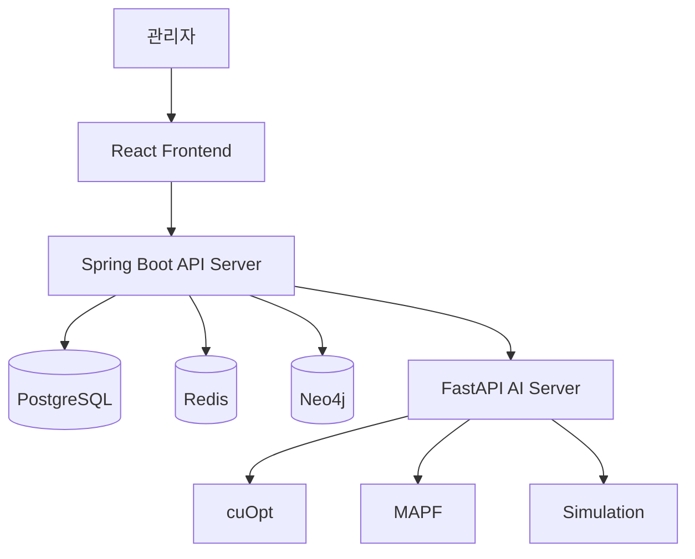

# LARO

> Digital Twin 기반 자율 창고 운영 및 다중 로봇 작업 최적화 시스템

## 프로젝트 소개

**LARO**는 창고 구조와 로봇 상태를 Digital Twin으로 관리하고, 여러 로봇의 작업 할당과 이동 경로를 최적화하는 자율 창고 운영 시스템입니다.

창고의 이동 구조를 Node와 Edge 기반 그래프로 표현하고, 로봇의 위치·배터리·작업 상태를 통합 관리하여 충돌과 정체를 줄이고 효율적인 창고 운영을 지원합니다.

본 저장소는 팀 프로젝트에서 담당한 백엔드 설계, 구현 및 문제 해결 과정을 정리한 개인 포트폴리오 저장소입니다.

---

## 선정 배경 및 문제 정의

물류창고에서 여러 로봇이 각각의 최단 경로만 따라 이동하면 좁은 통로나 교차 구간에서 충돌, 대기 및 정체가 발생할 수 있습니다.

또한 창고 구조, 로봇 상태와 작업 정보가 분산되어 있으면 관리자가 전체 운영 상황을 파악하고 예외 상황에 대응하기 어렵습니다.

이를 해결하기 위해 다음 기능을 제공하는 시스템을 기획했습니다.

- 창고 구조와 로봇 상태의 Digital Twin 관리
- 다중 로봇의 작업 할당 및 이동 경로 최적화
- 충돌, 지연 및 정체 상황 탐지
- 장애물과 배터리 부족 발생 시 경로 재계산
- 최적화 적용 전후의 운영 성능 비교

---

## 주요 기능

### 관리자 계정 및 권한 관리

- 기업 관리자 회원가입 및 로그인
- JWT 기반 사용자 인증
- 관리자 권한에 따른 API 접근 제어
- 관리자별 담당 창고 조회 및 관리
- 계정 정보 조회 및 수정

### 창고 레이아웃 관리

- 창고, 이동 노드 및 연결 경로 관리
- 노드 간 거리와 단방향·양방향 이동 관리
- 보관, 이동, 입고, 출고 및 충전 구역 관리

### 로봇 및 작업 관리

- 로봇 위치, 배터리와 작업 상태 관리
- 입출고 작업 생성 및 로봇 할당
- 충전소 위치와 사용 상태 관리

### 다중 로봇 경로 최적화

- cuOpt 기반 작업 할당 및 경로 최적화
- MAPF 기반 다중 로봇 충돌 방지
- 장애물과 통로 차단 발생 시 경로 재계산

### 실시간 관제 및 대시보드

- Redis 기반 로봇 실시간 상태 관리
- WebSocket 기반 로봇 위치 및 상태 전달
- 창고별 로봇 가동률과 작업 진행률 확인
- 충돌, 지연 및 정체 발생 현황 확인
- 전체 작업 시간, 이동 거리와 처리량 시각화
- 기존 방식과 최적화 방식의 KPI 비교

### AI 운영 지원

- 관리자의 자연어 명령을 작업 계획으로 변환
- 최적화 결과와 운영 현황 설명
- KPI 기반 운영 리포트 제공

### 게시판

- 공지사항 등록 및 조회
- 창고 운영 관련 게시글 작성
- 게시글 수정 및 삭제
- 사용자 간 운영 정보와 이슈 공유

---

## 담당 역할

백엔드에서 **창고 레이아웃 및 이동 그래프 관리, 경로 최적화 서버 연동 영역**을 담당하고 있습니다.

- Warehouse, WarehouseNode, WarehouseEdge, WarehouseZone API 구현
- Node와 Edge 기반 창고 이동 그래프 설계
- 이동 거리 및 단방향·양방향 통로 모델링
- ChargingStation 및 창고 레이아웃 통합 조회 구현
- PostgreSQL과 Neo4j 데이터 연동
- FastAPI 경로 최적화 서버 연동
- 경로 계산 및 재계산 결과 저장
- 로봇 장애 발생 시 작업 재배정 및 Redis 상태 갱신
- 재최적화 이력 조회 및 WebSocket 완료 이벤트 구현

---

## 기술 스택

### Backend

### Database

### AI 및 최적화

- FastAPI
- NVIDIA cuOpt
- MAPF

### Infrastructure

---

## 시스템 아키텍처

| 구성 요소 | 역할 |
|---|---|
| React | 창고 구조, 로봇 상태와 시뮬레이션 결과를 시각화합니다. |
| Spring Boot | 창고, 로봇, 작업과 경로 관련 API를 제공합니다. |
| PostgreSQL | 창고, 로봇, 작업과 실행 이력을 저장합니다. |
| Redis | 로봇 위치, 배터리와 실시간 상태를 관리합니다. |
| Neo4j | Node와 Edge 기반 창고 연결 구조를 관리합니다. |
| FastAPI | 경로 최적화와 시뮬레이션을 수행합니다. |
| cuOpt | 다중 로봇의 작업 할당과 경로를 최적화합니다. |
| MAPF | 여러 로봇의 충돌 없는 이동 경로를 탐색합니다. |

---

## 기대 효과

- 다중 로봇의 충돌과 교착 상황 감소
- 로봇의 이동 거리와 평균 대기 시간 감소
- 입출고 작업 처리 시간 단축
- 창고 구조와 로봇 상태의 통합 관제
- 장애물 및 배터리 부족 상황에 대한 신속한 대응
- 최적화 적용 전후의 운영 성능 정량화
- 자연어 명령을 통한 관리자 운영 편의성 향상

---

## 개발 기록

| 단계 | 주요 내용 | 문서 |
|---|---|---|
| 주제 선정 | 후보 주제 비교, 문제 정의 및 LARO 선정 | [주제 선정 과정](docs/01-topic-selection.md) |
| 설계 구체화 | 서비스 흐름, 역할 분담, ERD 및 시스템 구조 설계 | [서비스 및 데이터 설계](docs/02-service-and-data-design.md) |
| 백엔드 개발 | 개발환경 구성 및 창고 그래프 도메인 CRUD 구현 | [백엔드 개발 기록](docs/03-backend-development.md) |
| 동적 재최적화 | FastAPI 연동, 작업 재배정, 결과·이력 저장 및 WebSocket 알림 | [동적 재최적화 개발 기록](docs/04-dynamic-reoptimization.md) |
| 설계 의사결정 | Redis 위치 저장 단위, FE 보간, LLM 적용 범위 검토 | [설계 의사결정 기록](docs/05-design-decisions.md) |
| 게스트 접근 모드 | UUID 기반 게스트 JWT 인증과 시뮬레이션 실행 소유권 분리 | [개발 기록](docs/06-guest-access.md) |

