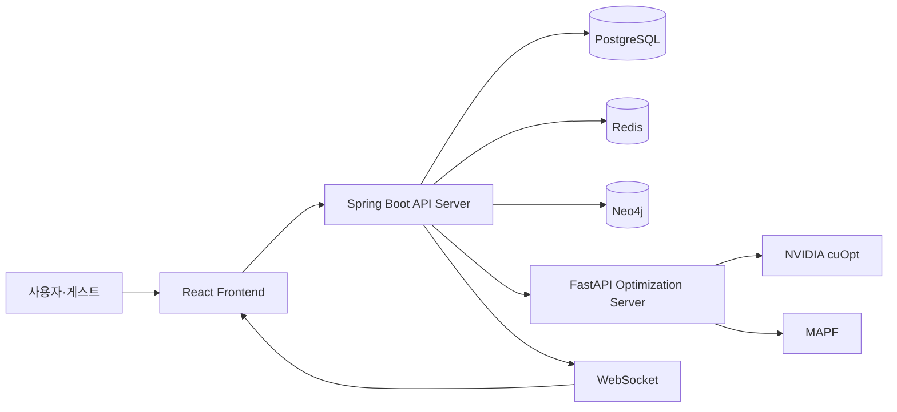

# LARO

> **Digital Twin 기반 자율 창고 운영 및 다중 로봇 작업 최적화 시스템**

[팀 백엔드 코드](https://github.com/kt-aivle-big-project/BE) · [개발 기록](#개발-기록)

## 프로젝트 소개

**LARO**는 창고 구조와 로봇 상태를 Digital Twin으로 관리하고, 여러 로봇의 작업 할당과 이동 경로를 최적화하는 자율 창고 운영 시스템입니다.

창고의 이동 구조를 `Node`와 `Edge` 기반 그래프로 표현하고, 로봇의 위치·배터리·작업 상태를 통합 관리합니다. 장애물이나 로봇 이상으로 기존 계획을 수행하기 어려운 경우에는 남은 작업과 로봇 상태를 기준으로 경로를 다시 계획합니다.

> 본 저장소는 팀 프로젝트에서 담당한 백엔드 설계, 구현 및 문제 해결 과정을 정리한 **개인 포트폴리오 저장소**입니다.
> 실제 서비스 코드는 팀 저장소에서 관리하고 있습니다.

---

## 문제 정의

다중 로봇이 각자의 최단 경로만 따라 이동하면 좁은 통로나 교차 구간에서 충돌, 대기 및 정체가 발생할 수 있습니다.

또한 창고 구조, 로봇 상태, 작업 정보가 분산되어 있으면 관리자가 전체 운영 상황을 파악하고 장애 상황에 대응하기 어렵습니다.

LARO는 다음 문제를 해결하는 것을 목표로 합니다.

* 창고 구조와 로봇 상태의 통합 관리
* 다중 로봇의 작업 할당 및 이동 경로 최적화
* 실시간 로봇 상태와 작업 진행 상황 관제
* 장애물 및 로봇 이상 발생 시 동적 재계획
* 최적화 적용 전후의 운영 지표 비교

---

## 구현 현황

| 기능                  |     상태     | 주요 내용                                          |
| ------------------- | :--------: | ---------------------------------------------- |
| 사용자 인증              |    ✅ 완료    | JWT 로그인, Access Token, Refresh Token 회전 및 로그아웃 |
| 게스트 체험 모드           |    ✅ 완료    | UUID 기반 `ROLE_GUEST` JWT와 실행 소유권 분리            |
| 창고 그래프 관리           |    ✅ 완료    | Warehouse·Zone·Node·Edge·ChargingStation 관리    |
| 창고 데이터 Import       |    ✅ 완료    | JSON 기반 창고 구조 등록 및 초기 데이터 구성                   |
| 창고 레이아웃 통합 조회       |    ✅ 완료    | 창고 구조, 로봇, 구역 및 충전소 통합 응답                      |
| PostgreSQL·Neo4j 연동 |    ✅ 완료    | 관계형 데이터 기반 Node·Edge 그래프 동기화                   |
| 시뮬레이션 실행 관리         |    ✅ 완료    | 실행 생성, 시작, 일시정지, 재개, 초기화 및 종료                  |
| 실시간 상태 전달           |    ✅ 완료    | Redis 상태 저장 및 WebSocket 이벤트 전달                 |
| 전역 재계획 백엔드          |    ✅ 완료    | 계획 검증, 임시 저장, DB 반영 및 Runtime 활성화              |
| FastAPI 최적화 연동      | 🟡 통합 검증 중 | 초기 계획·재계획 HTTP 계약과 예외 처리                       |
| cuOpt·MAPF 최적화      | 🟡 통합 검증 중 | AI 서버의 실제 최적화 결과와 End-to-End 검증                |
| 자연어 운영 지원           |  🚧 고도화 예정 | 관리자 명령 해석과 운영 결과 설명                            |
| KPI 비교 대시보드         |  🚧 고도화 예정 | 이동 거리, 작업 시간, 처리량 및 대기 시간 비교                   |

> `✅ 완료`는 백엔드 구현이 반영된 기능이며,
> `🟡 통합 검증 중`은 외부 AI 서버 또는 프론트엔드와의 최종 연동이 진행 중인 기능입니다.

---

## 주요 기능

### 1. 창고 Digital Twin 관리

* 창고, 구역, 이동 노드 및 연결 경로 관리
* 노드 간 거리와 단방향·양방향 통로 모델링
* 보관·이동·입고·출고·충전 구역 구분
* 창고 구조 JSON Import 및 통합 레이아웃 조회
* PostgreSQL의 창고 데이터를 Neo4j 그래프로 동기화

### 2. 로봇 및 시뮬레이션 관리

* 로봇 위치, 배터리 및 가용 상태 관리
* 입출고 작업 생성과 로봇 할당
* 시뮬레이션 생성 및 실행 상태 관리
* 실행 시작·일시정지·재개·초기화·종료
* Redis 기반 로봇 Runtime 상태 관리
* WebSocket 기반 로봇·작업 상태 전달

### 3. 동적 재계획

* 로봇 장애와 통로 차단 상황을 기반으로 재계획 요청
* 현재 로봇 상태와 남은 작업 Snapshot 구성
* FastAPI 재계획 API 연동
* AI 응답의 작업·로봇·경로·시간표 계약 검증
* 검증된 계획의 Staging 및 DB 반영
* 새로운 계획을 Runtime에 설치하고 실행 재개
* 재계획 결과 및 이력 저장

### 4. 사용자 및 게스트 접근 제어

* JWT 기반 회원가입·로그인·토큰 재발급
* DB 계정을 생성하지 않는 게스트 Access Token 발급
* `ROLE_USER`와 `ROLE_GUEST`의 API 접근 범위 분리
* UUID 기반 게스트 시뮬레이션 소유권 검증
* 다른 사용자 또는 게스트의 실행 접근 차단

---

## 주요 기여

백엔드 3인 분업 중 **창고·그래프·로봇·경로 최적화 연동 영역**을 중심으로 담당했습니다.

| 영역      | 기여 내용                                           |
| ------- | ----------------------------------------------- |
| 창고 도메인  | Warehouse·Zone·Node·Edge·ChargingStation API 구현 |
| 그래프 모델링 | 이동 거리와 단방향·양방향 통로 구조 설계                         |
| 레이아웃 조회 | 창고 구조와 로봇 정보를 포함한 통합 응답 구현                      |
| 데이터 연동  | PostgreSQL 데이터를 Neo4j Node·Relationship로 동기화    |
| 최적화 연동  | Spring Boot–FastAPI 초기 계획·재계획 요청 구조 구현          |
| 전역 재계획  | AI 계획 검증, Staging, DB 반영 및 Runtime 활성화 구현       |
| 상태 일관성  | 재계획 과정의 로봇·작업 상태와 실행 계획 갱신                      |
| 실시간 처리  | Redis 상태 갱신 및 WebSocket 완료 이벤트 구현               |
| 게스트 모드  | UUID 기반 게스트 JWT와 실행 소유권 격리 구현                   |

---

## 핵심 설계

### 관계형 데이터와 그래프 데이터 분리

* **PostgreSQL**: 창고, 로봇, 작업, 시뮬레이션 및 실행 이력 저장
* **Neo4j**: Node와 Edge 기반 창고 연결 관계 저장
* **Redis**: 실행 중인 로봇 위치, 상태 및 재생 정보 관리

영속 데이터, 그래프 탐색 데이터, 실시간 상태의 성격에 따라 저장소의 역할을 분리했습니다.

### 재계획 응답 검증

외부 AI 서버의 응답을 즉시 실행 상태에 반영하지 않고 다음 단계를 거치도록 구성했습니다.

```text
AI 재계획 응답
→ 계약 및 최신성 검증
→ 임시 계획 Staging
→ DB 상태 반영
→ Runtime 계획 설치
→ 시뮬레이션 재개
```

잘못된 작업 ID, 로봇 ID, 연결되지 않은 경로, 시간 역전, 노드·엣지 충돌 등이 포함된 계획은 적용 전에 거부합니다.

### 게스트 실행 격리

게스트에게 모든 API를 공개하지 않고 `ROLE_GUEST` JWT를 발급했습니다.

시뮬레이션 실행에는 토큰의 UUID를 `guest_session_id`로 저장하고, Service 계층에서 실행 소유권을 검증해 다른 게스트의 실행 조회와 조작을 차단했습니다.

---

## 기술 스택

### Backend


### Database


### AI·Optimization

`FastAPI` · `NVIDIA cuOpt` · `MAPF`

### Infrastructure·Collaboration


---

## 시스템 아키텍처



---

## 개발 기록

| 단계          | 주요 내용                         | 문서                                                 |
| ----------- | ----------------------------- | -------------------------------------------------- |
| 01. 주제 선정   | 후보 주제 비교와 LARO 선정 근거          | [주제 선정 과정](docs/01-topic-selection.md)             |
| 02. 설계 구체화  | 서비스 흐름, 데이터 저장소와 창고 그래프 설계    | [서비스 및 데이터 설계](docs/02-service-and-data-design.md) |
| 03. 백엔드 개발  | 개발 환경 구성과 창고 그래프 도메인 구현       | [백엔드 개발 기록](docs/03-backend-development.md)        |
| 04. 동적 재계획  | 재계획 요청, 계획 검증·반영 및 Runtime 적용 | [동적 재계획 개발 기록](docs/04-dynamic-reoptimization.md)  |
| 05. 설계 의사결정 | 실시간 위치 저장, 화면 보간과 AI 적용 범위 검토 | [설계 의사결정 기록](docs/05-design-decisions.md)          |
| 06. 게스트 접근  | 게스트 JWT 인증과 시뮬레이션 실행 소유권 분리   | [게스트 접근 개발 기록](docs/06-guest-access.md)            |

> 동적 재계획 문서는 백엔드 처리 구조를 중심으로 작성되어 있으며,
> 실제 cuOpt 연동과 통합 테스트 완료 후 결과와 성능 지표를 보완할 예정입니다.
