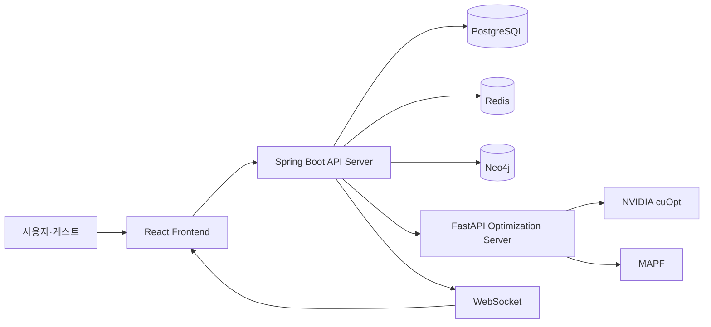

# 02. 서비스 및 데이터 설계

> 이 문서는 개발 착수 전 서비스 흐름과 데이터 구조를 구체화한 설계 기록입니다.
> 최종 구현 내용과 문제 해결 과정은 각 개발 기록 문서에서 별도로 다룹니다.

## 1. 설계 목표

주제 선정 후 바로 기능 개발을 시작하기보다, 서비스에서 필요한 데이터와 각 시스템의 책임을 먼저 구체화했습니다.

LARO는 창고 구조와 로봇 상태를 Digital Twin 형태로 관리하고, 다중 로봇의 작업 할당과 이동 경로를 최적화하는 시스템입니다.

설계 단계에서는 다음 내용을 중점적으로 정의했습니다.

* 관리자 관점의 서비스 이용 흐름
* Spring Boot와 FastAPI의 책임 분리
* PostgreSQL·Redis·Neo4j의 저장 데이터 구분
* 창고 구조를 표현할 그래프 도메인 설계
* 최적화 요청과 결과 반영 흐름
* 실시간 로봇 상태 처리 방식

---

## 2. 주요 서비스 흐름

관리자가 창고를 구성하고 시뮬레이션을 실행하는 기본 흐름을 다음과 같이 정의했습니다.

```text
로그인 및 창고 선택
        ↓
창고 레이아웃 등록
        ↓
Zone·Node·Edge·충전소 구성
        ↓
로봇과 입출고 작업 등록
        ↓
작업 할당 및 이동 경로 최적화
        ↓
시뮬레이션 실행
        ↓
실시간 로봇·작업 상태 관제
        ↓
실행 결과 및 KPI 확인
```

장애물이나 로봇 이상으로 기존 계획을 수행하기 어려운 경우에는 재계획 흐름으로 전환합니다.

```text
장애물 또는 로봇 이상 감지
        ↓
영향받은 로봇과 남은 작업 확인
        ↓
현재 실행 상태를 기준으로 재계획 요청
        ↓
새로운 작업 할당과 경로 검증
        ↓
실행 상태에 새 계획 반영
        ↓
시뮬레이션 재개
```

---

## 3. 시스템 구성과 역할

서비스 구성요소의 책임을 다음과 같이 분리했습니다.

| 구성요소        | 주요 역할                        |
| ----------- | ---------------------------- |
| React       | 창고 지도, 로봇 위치, 작업 현황 및 결과 시각화 |
| Spring Boot | 인증, 창고, 로봇, 작업 및 시뮬레이션 API   |
| FastAPI     | 작업 할당과 경로 최적화 계산             |
| PostgreSQL  | 업무 데이터와 실행 이력 저장             |
| Redis       | 실행 중인 로봇과 시뮬레이션 상태 관리        |
| Neo4j       | Node·Edge 기반 창고 이동 그래프 관리    |
| WebSocket   | 로봇과 작업 상태의 실시간 전달            |

### 전체 구조



Spring Boot는 업무 규칙과 영속 데이터 관리를 담당하고, FastAPI는 최적화 계산에 집중하도록 경계를 나눴습니다.

---

## 4. 데이터 저장소 역할 분리

모든 데이터를 하나의 저장소에 넣지 않고, 데이터의 특성에 따라 역할을 구분했습니다.

### PostgreSQL

서비스의 기준이 되는 정형 데이터와 변경 이력을 저장합니다.

* 사용자와 권한
* 창고와 구역
* 노드와 엣지
* 로봇과 상품
* 입출고 작업
* 시뮬레이션 실행 정보
* 최적화 계획과 실행 이력

관계와 트랜잭션 관리가 필요한 데이터를 PostgreSQL에서 관리합니다.

### Redis

짧은 주기로 변경되는 Runtime 상태를 저장합니다.

* 로봇의 현재 위치
* 배터리 잔량
* 로봇과 작업 상태
* 시뮬레이션 실행 상태
* 현재 적용 중인 계획 정보

현재 상태를 조회할 때마다 PostgreSQL을 조회하지 않고 Redis에서 빠르게 읽도록 설계했습니다.

### Neo4j

창고의 이동 가능 구조를 그래프로 관리합니다.

* 창고 Node
* Node 사이의 연결 관계
* 이동 거리
* 단방향·양방향 통로
* 인접 Node 탐색
* 장애물과 통로 차단 상태

PostgreSQL을 기준 데이터로 사용하고, 경로 탐색에 필요한 Node와 Edge를 Neo4j에 동기화하는 구조를 선택했습니다.

```text
PostgreSQL
→ 영속 데이터의 기준

Redis
→ 실행 중인 현재 상태

Neo4j
→ 창고의 이동 연결 관계
```

---

## 5. 창고 그래프 도메인 설계

창고의 물리 구조와 로봇 이동 경로를 표현하기 위해 다음 도메인으로 분리했습니다.

```text
Warehouse
 ├─ WarehouseZone
 ├─ WarehouseNode
 │    └─ WarehouseEdge
 ├─ StorageLocation
 └─ ChargingStation
```

### Warehouse

하나의 창고와 레이아웃을 구분하는 최상위 단위입니다.

* 창고 이름과 설명
* 가로·세로 크기
* 창고 활성 상태
* 소유 사용자

### WarehouseZone

창고 내부 영역을 용도에 따라 구분합니다.

| 구역 유형        | 의미       |
| ------------ | -------- |
| `STORAGE`    | 상품 보관 구역 |
| `MOVING`     | 로봇 이동 구역 |
| `INBOUND`    | 입고 구역    |
| `OUTBOUND`   | 출고 구역    |
| `CHARGING`   | 충전 구역    |
| `RESTRICTED` | 이동 제한 구역 |

구역은 최소·최대 X, Y 좌표를 저장해 창고 내 범위를 표현합니다.

### WarehouseNode

로봇이 이동하거나 작업을 수행할 수 있는 지점입니다.

* X·Y 좌표
* 소속 창고
* 소속 구역
* 노드 코드와 유형

좌표 자체보다 Node를 이동과 상태 관리의 기준으로 사용하도록 설계했습니다.

### WarehouseEdge

두 Node 사이의 이동 가능한 연결을 표현합니다.

* 시작 Node
* 도착 Node
* 이동 거리
* 이동 가능 방향

| 방향 유형    | 의미           |
| -------- | ------------ |
| `BOTH`   | 양방향 이동       |
| `A_TO_B` | A에서 B 방향만 이동 |
| `B_TO_A` | B에서 A 방향만 이동 |

이를 통해 일반 통로와 일방통행 통로를 동일한 구조에서 관리할 수 있습니다.

### StorageLocation

실제 상품이 보관되는 위치를 나타냅니다.

* 소속 창고와 구역
* 연결된 이동 Node
* 보관 가능 용량
* 현재 재고 상태

### ChargingStation

로봇이 충전을 수행하는 위치를 관리합니다.

* 소속 창고
* 연결된 위치 Node
* 충전소 이름
* 사용 가능 상태
* 충전 출력

---

## 6. 이동 Node와 보관 위치 분리

초기에는 이동 지점과 상품 보관 위치를 하나의 데이터로 관리하는 방식을 검토했습니다.

하지만 두 개념을 하나로 합치면 이동 전용 Node에도 보관 용량이나 재고 관련 값이 필요해져 사용하지 않는 필드가 증가합니다.

따라서 이동 경로와 보관 위치를 분리했습니다.

```text
WarehouseNode
→ 로봇이 이동하는 그래프 좌표

StorageLocation
→ 상품이 실제로 보관되는 위치
→ 인접한 WarehouseNode와 연결
```

이 구조를 통해 다음 책임을 명확하게 나눌 수 있었습니다.

* 경로 탐색은 `WarehouseNode`와 `WarehouseEdge`가 담당
* 재고 보관은 `StorageLocation`이 담당
* 보관 위치까지의 이동은 연결된 Node를 통해 계산

---

## 7. 최적화 연동 흐름

Spring Boot와 FastAPI의 연동 흐름은 다음과 같이 설계했습니다.

```text
Spring Boot
        ↓
창고 그래프·로봇·작업 데이터 조회
        ↓
FastAPI에 최적화 요청
        ↓
cuOpt를 이용한 작업 할당과 경로 계산
        ↓
MAPF를 이용한 시간 단위 충돌 조정
        ↓
Spring Boot에 최적화 결과 반환
        ↓
응답 데이터와 경로 유효성 검증
        ↓
PostgreSQL에 계획과 이력 저장
        ↓
Redis Runtime 상태에 계획 반영
        ↓
WebSocket으로 프론트엔드에 전달
```

### cuOpt

* 여러 작업을 로봇에 배분
* 작업 수행 순서 계산
* 전체 이동 비용을 고려한 경로 후보 생성

### MAPF

* 동일 시간에 동일 Node로 이동하는 충돌 방지
* 반대 방향으로 같은 Edge를 통과하는 충돌 방지
* 로봇별 대기 시간과 이동 시점 조정
* 시간 단위 경로 생성

작업 배정과 전체 비용 최적화는 cuOpt가 담당하고, 다중 로봇의 시간·공간 충돌 조정은 MAPF가 담당하도록 역할을 구분했습니다.

---

## 8. 실시간 상태 처리

로봇 위치와 배터리처럼 자주 바뀌는 값은 PostgreSQL에 매번 기록하지 않고 Redis를 중심으로 관리하도록 설계했습니다.

```text
시뮬레이션에서 로봇 상태 변경
        ↓
Redis Runtime 상태 갱신
        ↓
Spring Boot가 현재 상태 조회
        ↓
WebSocket으로 프론트엔드 전달
        ↓
중요 시점 또는 실행 종료 시 이력 저장
```

현재 상태와 영속 이력을 분리해 다음 두 가지를 함께 고려했습니다.

* 실시간 조회 성능
* 실행 결과와 변경 이력 보존

프론트엔드는 전달받은 Node와 시간 정보를 기반으로 로봇의 화면상 이동을 보간합니다.

---

## 9. 설계 결과

설계 과정을 통해 아이디어 수준의 주제를 실제 개발 가능한 구조로 구체화했습니다.

주요 결정 사항은 다음과 같습니다.

* Spring Boot와 FastAPI의 책임 분리
* 데이터 특성에 따른 PostgreSQL·Redis·Neo4j 역할 분리
* Warehouse·Zone·Node·Edge 기반 창고 그래프 모델링
* 이동 Node와 실제 보관 위치 분리
* cuOpt와 MAPF의 최적화 책임 분리
* Redis와 WebSocket 기반 실시간 상태 처리
* 재계획 결과를 검증한 뒤 실행 상태에 반영하는 구조

이 설계를 기준으로 Spring Boot 개발 환경을 구성하고, 창고 그래프 도메인과 최적화 연동 기능을 단계적으로 구현했습니다.
