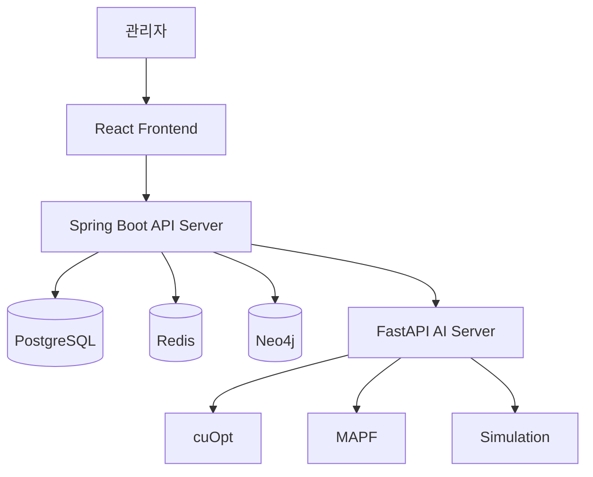

# 서비스 및 데이터 설계

## 1. 설계 진행 배경

프로젝트 1~2주차에는 후보 주제를 조사하고 비교한 뒤, 최종적으로 다음 주제를 선정했습니다.

> **LARO: Digital Twin 기반 자율 창고 운영 및 다중 로봇 작업 최적화 시스템**

주제 선정 후 바로 개발을 시작하기보다, 실제 서비스에서 필요한 기능과 데이터 흐름을 먼저 구체화했습니다.

3주차 초반 3일 동안 다음 내용을 중심으로 설계를 진행했습니다.

- 서비스 주요 기능 정의
- 관리자 화면 흐름 구체화
- Spring Boot, FastAPI, React 역할 분리
- PostgreSQL, Redis, Neo4j 저장 데이터 구분
- 백엔드 역할 분담
- 창고 구조 ERD 설계
- 경로 최적화 및 시뮬레이션 연동 흐름 설계

---

## 2. 서비스 목표

LARO는 창고 구조와 로봇 상태를 Digital Twin 형태로 관리하고, 여러 로봇의 작업 할당과 이동 경로를 최적화하는 시스템입니다.

관리자는 하나의 화면에서 다음 정보를 확인하고 제어할 수 있습니다.

- 창고 레이아웃
- 로봇 위치와 이동 경로
- 로봇 배터리 및 작업 상태
- 입출고 작업 현황
- 충돌, 지연 및 정체 상황
- 최적화 전후 성능 지표
- 시뮬레이션 실행 결과

---

## 3. 주요 사용자 흐름

관리자가 창고를 등록한 뒤 시뮬레이션을 실행하는 전체 흐름을 다음과 같이 정의했습니다.

```text
기업 관리자 로그인
  ↓
담당 창고 선택 또는 창고 생성
  ↓
창고 레이아웃 등록
  ↓
Node, Edge, Zone, 충전소 구성
  ↓
로봇 및 입출고 작업 등록
  ↓
경로 최적화 및 시뮬레이션 실행
  ↓
실시간 관제와 대시보드 확인
```

### 예외 상황 흐름

```text
장애물 또는 통로 차단 발생
  ↓
기존 경로 사용 가능 여부 확인
  ↓
영향받는 로봇과 작업 탐색
  ↓
경로 재계산 요청
  ↓
변경된 경로 전달
  ↓
시뮬레이션 재개
```

배터리가 부족한 경우에는 현재 작업과 충전소 위치를 고려하여 충전 경로를 계산하는 방향으로 설계했습니다.

---

## 4. 시스템 역할 분리

각 서버가 담당하는 역할을 명확하게 분리했습니다.

| 구성 요소 | 주요 역할 |
|---|---|
| React | 창고 지도, 로봇 위치, 작업 현황 및 결과 시각화 |
| Spring Boot | 사용자, 창고, 로봇, 작업 및 시뮬레이션 API 제공 |
| FastAPI | 작업 할당, 경로 최적화 및 시뮬레이션 계산 |
| PostgreSQL | 창고, 로봇, 작업 및 실행 이력 저장 |
| Redis | 로봇 위치, 배터리 및 실시간 상태 저장 |
| Neo4j | Node와 Edge 기반 창고 이동 그래프 관리 |
| WebSocket | 로봇 위치와 상태를 프론트엔드에 실시간 전달 |

### 전체 구조



---

## 5. 데이터 저장소 역할 분리

프로젝트에서는 모든 데이터를 하나의 데이터베이스에 저장하지 않고, 데이터의 특성에 따라 저장소를 구분했습니다.

### PostgreSQL

변경 이력과 관계 관리가 필요한 정형 데이터를 저장합니다.

- 사용자 및 권한
- 창고 기본 정보
- 로봇 기본 정보
- 입출고 작업
- 시뮬레이션 정보
- 경로 계산 요청 및 결과
- 실행 이력

### Redis

짧은 주기로 계속 변경되는 실시간 상태 데이터를 저장합니다.

- 로봇 현재 위치
- 배터리 잔량
- 현재 작업 상태
- 이동 속도
- 시뮬레이션 실행 상태

실시간 화면 조회 시 매번 PostgreSQL을 조회하는 대신 Redis에서 현재 상태를 빠르게 조회하는 방향으로 설계했습니다.

### Neo4j

창고의 이동 구조를 그래프 형태로 관리합니다.

- WarehouseNode
- WarehouseEdge
- 노드 간 연결 관계
- 단방향 및 양방향 통로
- 장애물과 통로 차단 상태
- 특정 노드와 연결된 인접 노드 탐색

PostgreSQL은 업무 데이터 관리에 사용하고, Neo4j는 창고 연결 구조와 경로 관련 탐색에 사용하는 방향으로 역할을 구분했습니다.

---

## 6. 백엔드 역할 분담

백엔드 3명이 각자 담당 영역을 명확히 설명할 수 있도록 기능 중심으로 역할을 분리했습니다.

| 구분 | 담당 영역 |
|---|---|
| BE 1 | 인증, 권한 및 공통 설정 |
| BE 2 | 창고, 이동 그래프 및 경로 최적화 연동 |
| BE 3 | 작업, 시뮬레이션 및 실시간 상태 처리 |

### BE 1

- 회원가입 및 로그인
- JWT 인증
- 사용자 및 권한 관리
- 공통 응답 구조
- 전역 예외 처리
- Swagger 설정
- API 접근 권한 관리

### BE 2 — 개인 담당

- Warehouse 관리
- WarehouseNode 관리
- WarehouseEdge 관리
- WarehouseZone 관리
- ChargingStation 관리
- 창고 레이아웃 통합 조회
- Neo4j 그래프 동기화
- FastAPI 경로 최적화 요청
- cuOpt 및 MAPF 연동
- 경로 계산 및 재계산
- 경로 결과 저장

### BE 3

- 입출고 작업 생성
- 작업 할당 및 상태 변경
- 시뮬레이션 생성, 시작 및 종료
- 로봇 실시간 상태 관리
- Redis 연동
- WebSocket 실시간 전달

---

## 7. 창고 데이터 구조 설계

창고의 이동 구조를 표현하기 위해 주요 데이터를 다음과 같이 분리했습니다.

```text
Warehouse
 ├─ WarehouseZone
 ├─ WarehouseNode
 │    └─ WarehouseEdge
 └─ ChargingStation
```

### Warehouse

하나의 창고 레이아웃을 구분하는 기준입니다.

- 창고 이름
- 창고 크기
- 소유 사용자
- 레이아웃 기본 정보

### WarehouseNode

로봇이 이동하거나 작업을 수행할 수 있는 지점을 좌표로 표현합니다.

- X 좌표
- Y 좌표
- 소속 창고
- 소속 구역

### WarehouseEdge

두 Node 사이의 연결 관계를 표현합니다.

- 출발 노드
- 도착 노드
- 이동 거리
- 이동 가능 방향

이동 방향은 다음과 같이 구분했습니다.

```java
public enum DirectionType {
    BOTH,
    A_TO_B,
    B_TO_A
}
```

이를 통해 양방향 통로와 일방통행 통로를 함께 표현할 수 있도록 설계했습니다.

### WarehouseZone

창고 내부 공간을 용도에 따라 구분합니다.

```java
public enum ZoneType {
    STORAGE,
    MOVING,
    INBOUND,
    OUTBOUND,
    CHARGING,
    RESTRICTED
}
```

구역은 최소·최대 X, Y 좌표를 저장하여 창고 내 영역을 나타내도록 설계했습니다.

### ChargingStation

로봇이 충전을 수행하는 위치와 상태를 관리합니다.

- 소속 창고
- 위치 노드
- 충전소 이름
- 사용 가능 상태
- 충전 출력

---

## 8. 이동 노드와 보관 위치 분리

초기에는 이동 노드와 보관 위치를 하나의 테이블에 함께 저장하는 방식을 검토했습니다.

그러나 하나의 테이블에 모든 정보를 넣으면 이동 전용 노드에 보관 관련 값이 `null`로 남고, 노드 유형에 따라 사용하지 않는 컬럼이 많아질 수 있습니다.

따라서 다음과 같이 역할을 분리하는 방향을 검토했습니다.

```text
WarehouseNode
- 로봇 이동 경로를 구성하는 좌표

StorageLocation
- 실제 재고가 보관되는 위치
- 필요 시 인접한 WarehouseNode와 연결
```

이 구조를 사용하면 이동 그래프와 재고 보관 위치의 책임을 분리할 수 있습니다.

---

## 9. 경로 최적화 연동 흐름

Spring Boot와 FastAPI의 연동 흐름을 다음과 같이 설계했습니다.

```text
Spring Boot
  ↓
창고 Node, Edge와 로봇·작업 데이터 조회
  ↓
FastAPI에 최적화 요청
  ↓
cuOpt 작업 할당 및 경로 계산
  ↓
MAPF 충돌 검사 및 시간 단위 경로 조정
  ↓
Spring Boot에 결과 반환
  ↓
PostgreSQL에 경로 결과 저장
  ↓
Redis에 현재 실행 상태 반영
  ↓
WebSocket으로 프론트엔드에 전달
```

### cuOpt 역할

- 여러 작업을 로봇에 분배
- 전체 이동 비용을 고려한 작업 순서 계산
- 로봇별 이동 경로 후보 생성

### MAPF 역할

- 동일 시간에 동일 노드 진입 방지
- 서로 반대 방향으로 같은 Edge를 통과하는 충돌 방지
- 교착과 대기 시간 조정
- 시간 단위 로봇 경로 생성

두 기술의 역할을 분리하여 작업 할당 최적화와 충돌 방지를 함께 처리하는 방향으로 설계했습니다.

---

## 10. 실시간 상태 처리 방향

로봇의 위치와 배터리는 짧은 주기로 변경되기 때문에 PostgreSQL에 매번 저장하지 않고 Redis를 중심으로 관리하는 방향을 결정했습니다.

```text
로봇 시뮬레이션 상태 변경
  ↓
Redis 현재 상태 갱신
  ↓
Spring Boot가 상태 수신
  ↓
WebSocket으로 프론트엔드 전달
  ↓
중요 시점 또는 작업 종료 시 PostgreSQL 이력 저장
```

이를 통해 현재 상태 조회 성능과 이력 관리의 균형을 맞추고자 했습니다.

---

## 11. 관리자 화면 구상

관리자가 창고 운영 상황을 한눈에 확인할 수 있도록 다음 화면을 구상했습니다.

### 관제 화면

- 창고 지도
- 로봇 현재 위치
- 로봇 이동 경로
- 작업 진행 상태
- 장애물 및 통로 차단 구간
- 충돌 위험 표시
- 시뮬레이션 시작, 정지 및 초기화

### 로봇 상세 정보

- 로봇 ID
- 현재 위치
- 배터리 잔량
- 현재 작업
- 이동 상태
- 충전 필요 여부
- 예상 작업 완료 시간

### 결과 화면

- 전체 작업 완료 시간
- 평균 대기 시간
- 총 이동 거리
- 충돌 및 교착 횟수
- 단위 시간당 처리량
- 최적화 전후 비교

### 운영 대시보드

- 전체 로봇 수와 가동 로봇 수
- 작업 대기, 진행 및 완료 건수
- 로봇 평균 배터리 잔량
- 충돌 위험 및 지연 발생 건수
- 전체 작업 완료 시간
- 평균 대기 시간
- 총 이동 거리
- 단위 시간당 처리 작업 수
- 최적화 적용 전후 KPI 비교

### 게시판

서비스 이용자와 운영 관리자가 공지사항과 창고 운영 정보를 공유할 수 있도록 게시판 기능을 구성합니다.

- 공지사항 작성 및 조회
- 일반 게시글 작성, 조회, 수정 및 삭제
- 작성자 기준 권한 확인
- 게시글 목록 및 상세 조회
---

## 12. 성능 평가 기준

단순히 시뮬레이션이 실행되는 것에 그치지 않고, 기존 방식과 최적화 방식의 차이를 수치로 비교하도록 계획했습니다.

| 평가 지표 | 설명 |
|---|---|
| 전체 작업 완료 시간 | 모든 작업이 종료될 때까지 걸린 시간 |
| 평균 대기 시간 | 로봇이 충돌 방지 또는 정체로 대기한 평균 시간 |
| 총 이동 거리 | 전체 로봇이 이동한 거리의 합 |
| 충돌 발생 횟수 | 동일 위치 또는 Edge에서 충돌이 발생한 횟수 |
| 교착 발생 횟수 | 여러 로봇이 서로의 이동을 막은 횟수 |
| 처리량 | 단위 시간 동안 완료한 작업 수 |
| 작업량 편차 | 특정 로봇에 작업이 집중되는 정도 |

동일한 창고 레이아웃과 작업 시나리오에서 기존 방식과 최적화 방식을 각각 실행하여 비교하는 방향으로 정했습니다.

---

## 13. 설계 과정에서 결정한 사항

설계 과정에서 다음과 같은 방향을 결정했습니다.

- Spring Boot는 업무 API와 데이터 관리를 담당
- FastAPI는 최적화와 시뮬레이션 계산을 담당
- PostgreSQL은 정형 데이터와 실행 이력을 저장
- Redis는 로봇의 현재 상태를 저장
- Neo4j는 Node와 Edge 기반 이동 그래프를 관리
- 이동 노드와 보관 위치는 역할을 분리
- 작업 할당은 cuOpt, 충돌 방지는 MAPF를 중심으로 구성
- 초기 시각화는 2D 창고 지도를 우선 구현
- 최적화 전후의 성능을 동일 시나리오에서 비교

---

## 14. 설계 결과

3일간의 설계 구체화를 통해 주제 수준의 아이디어를 실제 개발 가능한 구조로 정리했습니다.

특히 다음 내용을 명확하게 정의할 수 있었습니다.

- 사용자 관점의 서비스 흐름
- 백엔드, AI 서버와 프론트엔드의 역할
- PostgreSQL, Redis와 Neo4j의 저장 데이터
- 백엔드 3인의 담당 영역
- Warehouse, Node, Edge와 Zone의 관계
- 경로 최적화 요청 및 결과 처리 흐름
- 실시간 로봇 상태 전달 방식
- 성능 평가 지표

이 설계를 바탕으로 3주차 후반부터 Spring Boot 개발환경 구성과 창고 도메인 API 구현을 시작했습니다.
